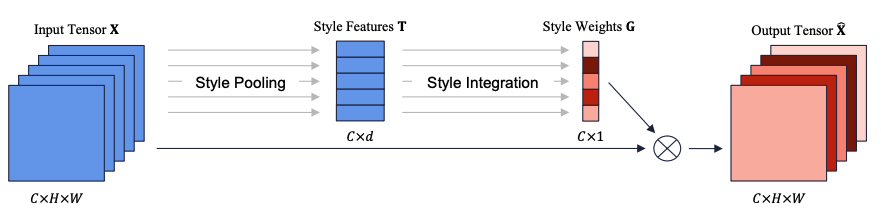
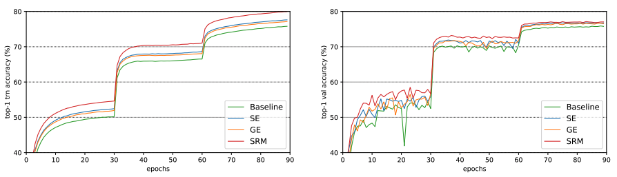
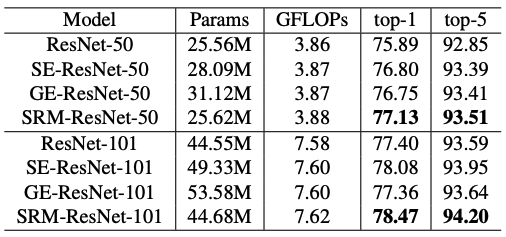
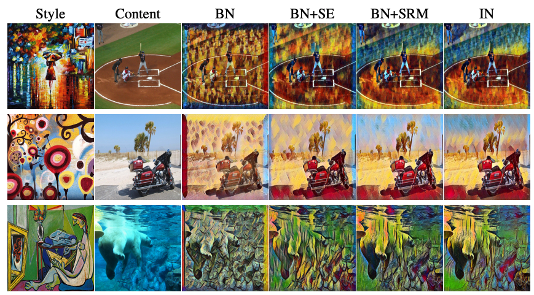

# Style-Based Recalibration Module
The official PyTorch implementation of "SRM : A Style-based Recalibration Module for Convolutional Neural Networks" for ImageNet.
SRM is a lightweight architectural unit that dynamically recalibrates feature responses based on style importance.



## Overview of Results

### Training and validation curves on ImageNet with ResNet-50



### Top-1 and top-5  accuracy (%) on the ImageNet-1K validation set



### Example results of style transfer



## Prerequisites
- PyTorch 0.4.0+
- Python 3.6
- CUDA 8.0+

## Training Examples
* Train **ResNet-50**
```
python imagenet.py --depth 50 --data /data/imagenet/ILSVRC2012 --gpu-id 0,1,2,3,4,5,6,7 --checkpoint resnet50/baseline
```

* Train **SRM-ResNet-50**
```
python imagenet.py --depth 50 --data /data/imagenet/ILSVRC2012 --gpu-id 0,1,2,3,4,5,6,7 --checkpoint resnet50/srm --recalibration-type srm
```

* Train **SE-ResNet-50**
```
python imagenet.py --depth 50 --data /data/imagenet/ILSVRC2012 --gpu-id 0,1,2,3,4,5,6,7 --checkpoint resnet50/se --recalibration-type se
```

* Train **GE-ResNet-50**
```
python imagenet.py --depth 50 --data /data/imagenet/ILSVRC2012 --gpu-id 0,1,2,3,4,5,6,7 --checkpoint resnet50/ge --recalibration-type ge
``` 

## Acknowledgment
This code is heavily borrowed from [pytorch-classification](https://github.com/bearpaw/pytorch-classification).

## Note
* 28/05/2019: initial code for ImageNet is released
